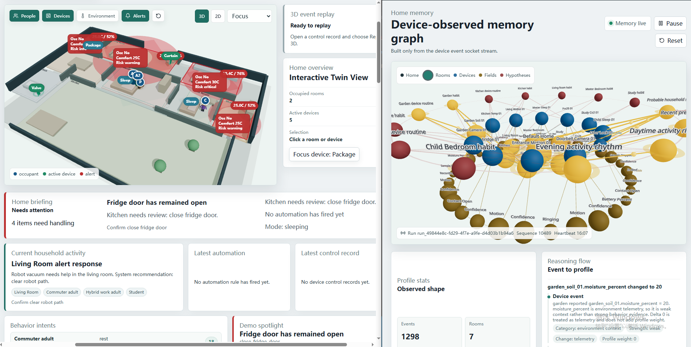

# VirtualHome Twin Demo

Standalone smart-home simulation and digital-twin demo.

## Simulator & Dynamic Home Memory



## Run

Install dependencies:

```bash
npm install
```

Start the API server:

```bash
npm run server
```

To run the server with a different compatible home template in PowerShell:

```powershell
$env:VIRTUALHOME_HOME_DEFINITION = ".\my-home-definition.json"
npm run server
```

For long-running demos, cap retained telemetry rows per simulation run:

```powershell
$env:VIRTUALHOME_TELEMETRY_RETENTION_EVENTS = "5000"
npm run server
```

Start the web console in another terminal:

```bash
npm run dev
```

Open:

```text
http://127.0.0.1:5173
```

## What is implemented

- TypeScript simulation core for one default model-driven virtual family home.
- Nine rooms, three human family members, one pet, and 35 virtual devices loaded from `src/sim/defaultHomeDefinition.json`.
- Three static scenarios plus generated daily routines from date and seed.
- Internal twin events for people movement, device state, telemetry, rules, alerts, scenario control, and recovery.
- Household routines keep device control tied to plausible user actions, sensor observations, or deterministic automation rules.
- SQLite-backed append-only events, optionally capped telemetry, idempotency records, and checkpointed state snapshots.
- Startup recovery from persisted snapshots with event replay. Persisted snapshots are ignored when their home definition no longer matches the current rooms, devices, people, or home id.
- Fastify REST API, OpenAPI document at `/api/openapi.json`, and WebSocket event-delta updates with heartbeat/reconnect cursors.
- Adapter-facing device twin view at `/api/device-twins` with desired state, reported state, connectivity, freshness, and command acknowledgement metadata.
- Telemetry summary endpoint at `/api/telemetry/summary` for aggregated metrics over recent event windows.
- Server-side privacy projection for public state/events.
- React demo console with floorplan, device state, alerts, timeline, scenario controls, daily routine generation, manual advance, pause/resume, abnormality injection, retryable commands, and recovery actions.

## Simulation realism

- Device state changes are generated from explicit scenario steps, manual commands, sensor-triggered rules, or routine behavior with a concrete household actor.
- Fully automated devices, such as robot vacuum behavior and safety recovery, are modeled as automation rather than as implicit pet or random user control.
- Sleep and away states constrain routine behavior so lights, appliances, and mobile devices do not keep acting as if the household were awake.
- The 3D floorplan animates recent people and pet movement, but suppresses ambient pet/routine movement trails so frequent movement does not leave noisy blue route lines.

## Boundary

This repository is still a single-home simulation sandbox. It now exposes protocol and adapter seams that a real digital twin would need, but it does not yet connect to MQTT, Matter, Home Assistant, authentication, RBAC, or multiple persisted homes. The simulated home definition is externalized as a default template so future work can load other homes without rewriting the simulator.

## API Surface

- `GET /api/openapi.json` describes the REST and WebSocket protocol.
- `GET /api/state`, `/api/events`, and `/api/telemetry` expose current state and recent history.
- `GET /api/home-definition` exposes the default model-driven home template.
- `GET /api/device-twins` exposes adapter-facing device access records.
- `GET /api/device-capabilities` exposes the serializable device capability registry.
- `GET /api/telemetry/summary` returns aggregated telemetry metrics.
- `GET /api/audit/access` returns recent read-access audit records for privacy-sensitive APIs.
- `POST /api/daily/start`, `/api/scenarios/:id/start`, and `/api/control/*` mutate the simulation. Control requests accept `idempotencyKey` for safe retries.
- `GET /ws` streams `twin.update` event deltas and `twin.heartbeat` messages. Clients reconnect with `runId` and `afterSequence`.
- `GET /ws/device-events` streams flattened `device.update` deltas for adapter-style consumers that only need device telemetry and state changes.

## 架构文档

- [事件生成流程](./docs/event-generation-flow.md)
- [家庭 Memory 处理流程](./docs/home-memory-processing-flow.md)
- [Home Memory 计算细节](./docs/home-memory-calculation-details.md)
- [Home Memory 演示讲稿](./docs/home-memory-demo-script.md)

## Verification

```bash
npm ci
npm run verify
```
