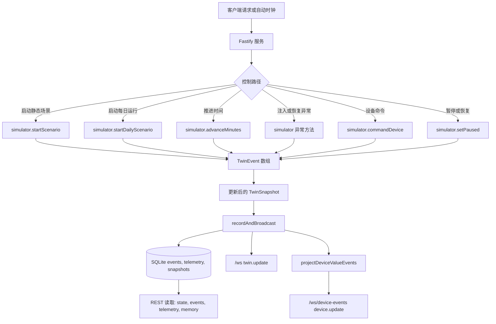
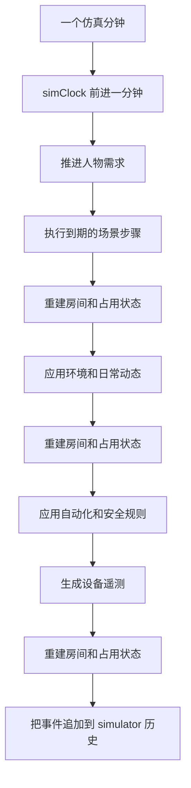
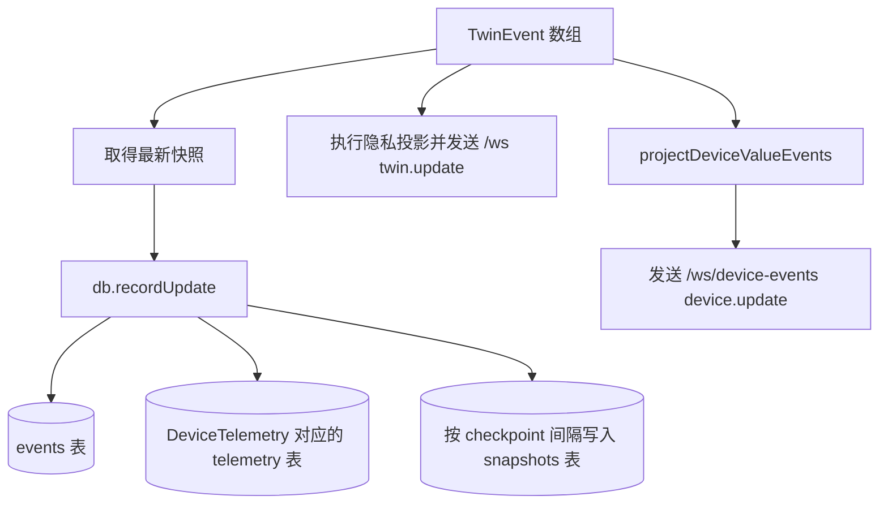

# 事件生成流程

本文说明 VirtualHome 如何生成、记录并投递数字孪生事件。内容基于当前实现：`src/sim/engine.ts`、`src/server/app.ts`、`src/server/persistence.ts` 和 `src/server/deviceEventStream.ts`。

## 目标

VirtualHome 使用事件溯源的仿真模型。控制命令和定时推进会修改内存中的 `TwinSnapshot`，每一次有意义的状态变化都会产出一个带类型的 `TwinEvent`。服务端会把这些事件写入 SQLite，并通过 REST 和 WebSocket 对外发布。

## 总览流程

## 运行时入口

服务启动时会创建一个 simulator 实例：

- `createServer()` 加载家庭定义。
- `createSimulator()` 创建运行时状态、带 seed 的随机数生成器、初始快照和默认场景。
- `TwinDatabase` 打开 SQLite 数据库，并创建事件、遥测、快照、幂等记录和访问审计表。
- 如果 SQLite 中存在兼容的快照，simulator 会从该快照恢复，并回放 checkpoint 之后的事件。
- 如果没有兼容快照，服务会在 `onReady` 中启动一个生成的每日场景。

运行时事件通过以下路径进入系统：

| 路径 | 服务端接口或 hook | Simulator 方法 |
| --- | --- | --- |
| 启动静态场景 | `POST /api/scenarios/:id/start` | `startScenario(id)` |
| 生成每日例程 | `POST /api/daily/start` | `startDailyScenario(options)` |
| 手动推进时钟 | `POST /api/control/advance` | `advanceMinutes(minutes)` |
| 暂停或恢复 | `POST /api/control/pause`, `/api/control/resume` | `setPaused(paused)` |
| 注入或恢复异常 | `POST /api/control/inject`, `/api/control/resolve` | `injectAbnormality(kind)`, `resolveAbnormality(kind)` |
| 设备命令 | `POST /api/devices/:deviceId/command` | `commandDevice(deviceId, command, value)` |
| 更新告警生命周期 | `POST /api/alerts/:alertId/status` | `setAlertStatus(alertId, status)` |
| 自动时钟推进 | `onReady` interval | `advanceMinutes(1)` |

所有会修改状态的 REST 路径都使用相同的服务端模式：

1. 使用 Zod 校验请求。
2. 执行对应的 simulator 方法。
3. 把返回的事件传给 `recordAndBroadcast(events)`。
4. 返回 `{ snapshot, events }`。

支持幂等的控制路径可以传入 `idempotencyKey`。服务端会在 SQLite 中保存请求 hash 和响应内容，使安全重试返回同一份结果。

## 每分钟仿真循环

`advanceMinutes(minutes)` 是核心事件生成循环。每一个仿真分钟都会执行：

主要阶段包括：

- 场景步骤：来自静态场景或生成的每日计划。步骤可以移动人物、开始活动、改变设备状态、注入外部交互并创建对话。
- 环境和日常动态：包括宠物移动、家电生命周期、扫地机器人生命周期、路由器重启生命周期、冰箱门生命周期、空调影响、人物一致性、自主 agent 策略、行为画像交互、家庭社交协调、外部上下文、天气影响、安静模式保护和日常例程。
- 规则：确定性的自动化和安全响应，包括睡眠模式、离家模式、漏水响应、开门告警、冰箱门长开告警、网络恢复、扫地机器人告警和作业提醒。
- 遥测：基于当前快照和传感器模型生成的传感器与设备遥测。

每个阶段都会返回零个或多个 `TwinEvent`。循环会在阶段之间更新聚合的房间和占用状态，使后续阶段看到最新快照。

## 事件类型和来源层

所有事件都是 `TwinEvent` 记录，并带有通用运行时字段：

- `id`
- `runId`
- `ts`
- `simTime`
- `homeId`
- `scenarioId`
- `sequence`
- `sourceLayer`
- `lineage`
- 可选的 `rngStateAfter`

`createEvent()` 统一分配这些字段。它会递增快照序号，同步 run 上下文，在调用方没有提供来源层时推断 `sourceLayer`，并创建包含事件时间、摄入时间、可观测性、schema 版本和行为模型版本的 lineage 元数据。

来源层如下：

| 来源层 | 含义 | 典型事件 |
| --- | --- | --- |
| `truth` | 家庭行为的真值层 | `PersonMoved`, `ActivityStarted`, `ActivityEnded`, `ConversationOccurred`, `ExternalInteractionOccurred` |
| `world` | 世界或设备状态变化 | `DeviceStateChanged`, `ObjectMoved` |
| `sensor` | 传感器或设备遥测 | `DeviceTelemetry` |
| `control` | 场景或操作员控制 | `ScenarioControl`, `AbnormalityInjected`, 告警状态变化 |
| `inference` | 规则和自动化输出 | `AutomationTriggered`, `AlertCreated`, `RuleRecovered` |

## 设备状态事件

设备状态变化通过 `setDeviceState()` 或 `setDeviceStateIfChanged()` 进入事件流：

1. 使用设备注册表 schema 校验 patch。
2. 把合法字段合并到设备的快照状态。
3. 保存 `lastReason`。
4. 产出 `DeviceStateChanged`。

手动设备命令包含额外结构：

1. 校验设备存在。
2. 校验命令受支持。
3. 必要时创建操作员靠近设备的移动事件。
4. 创建一个或多个由命令驱动的设备状态事件。
5. 当命令解决告警条件时，恢复相关规则。
6. 必要时创建操作员返回移动事件。
7. 把所有事件追加到 simulator 历史。

## 遥测事件

遥测在规则执行之后生成，因此遥测观察到的是当前模拟世界状态。`generateTelemetry()` 会扫描受支持的设备类型，并根据以下来源创建 `DeviceTelemetry` 事件：

- 传感器画像和观测模型。
- 当前房间占用和环境状态。
- 当前设备状态，例如冰箱门、路由器健康状态、家电电源、洗衣机或洗碗机生命周期、漏水检测和睡眠传感器状态。

遥测事件很重要，因为它们是家庭 memory 子系统的主要输入。memory 子系统刻意使用扁平化后的设备遥测和状态值，而不是使用私密的家庭真值标签。

## 持久化和投递

`recordAndBroadcast(events)` 是仿真层到外部客户端之间的服务端桥接：

SQLite 保存：

- `events`：每个 run 的 append-only 事件 payload。
- `telemetry`：`DeviceTelemetry` payload，可以通过 `VIRTUALHOME_TELEMETRY_RETENTION_EVENTS` 按 run 限制保留量。
- `snapshots`：按 `snapshotIntervalEvents` checkpoint 的快照。
- `idempotency_records`：支持命令安全重试的响应记录。
- `access_audit`：隐私敏感 API 的读取访问审计。

服务端用三种形式暴露事件：

- 通过 `/api/events` 和 `/api/telemetry` 提供 REST 历史读取。
- 通过 `/ws` 提供完整 twin WebSocket delta。
- 通过 `/ws/device-events` 提供仅包含设备值的 delta。

`/ws/device-events` 有意比 `/ws` 更窄。它把 `DeviceTelemetry.measurements` 和 `DeviceStateChanged.state` 展平成 `{ deviceId, roomId, field, value, sequence }` 记录，供 adapter 和 memory 处理使用。

## 恢复模型

服务启动时会检查最新持久化快照。只有当快照仍然匹配当前家庭定义时才会恢复。兼容性检查可以避免把快照回放到不兼容的房间、设备、人物或 home 定义上。

当快照兼容时：

1. simulator 恢复快照。
2. 快照序号之后的事件被回放到快照上。
3. 已执行场景步骤、传感器观测、人物需求、已触发规则、规则生命周期状态和 RNG 状态等运行时集合会被重建。

当没有兼容快照时，服务会启动一个新的生成每日 run。

## 保证和边界

- 在同一个 run 内，事件 sequence 单调递增。
- 事件 payload 以 JSON 形式持久化，因此旧事件可以被回放或重新投影。
- 在相同 seed 和兼容输入下，simulator 是确定性的。
- 隐私投影发生在 API/WebSocket 读取时；持久化的内部事件保留完整 simulator 细节。
- 当前 Home memory 没有作为单独的物化 SQLite 表保存，而是由 memory 查询层从持久化事件重建。
