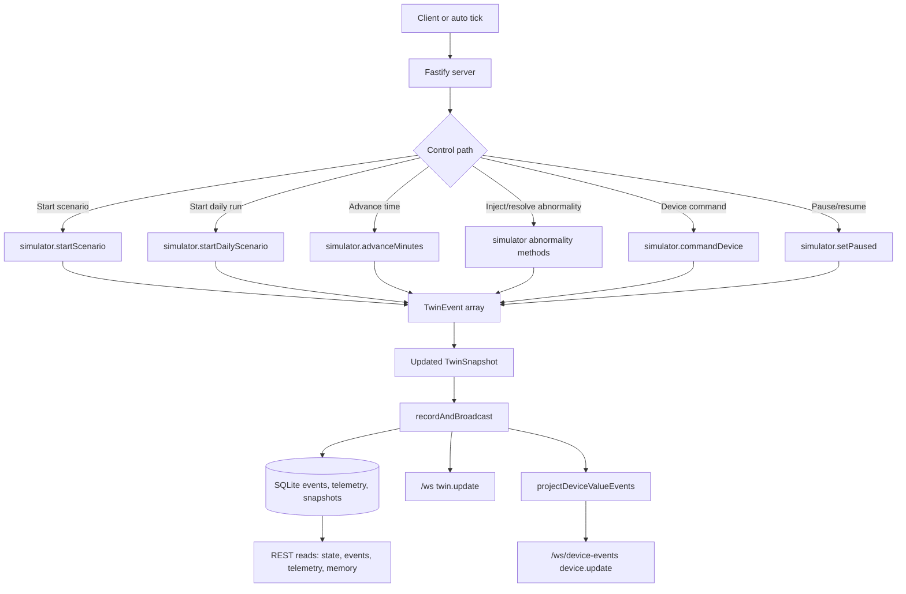
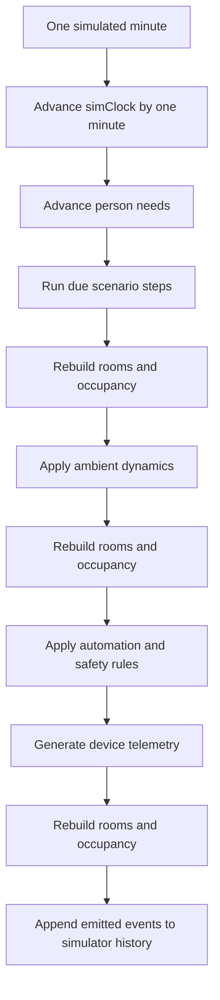
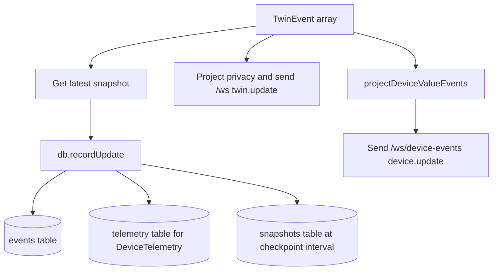

# Event Generation Flow

This document describes how VirtualHome creates, records, and delivers twin events. It is written from the current implementation in `src/sim/engine.ts`, `src/server/app.ts`, `src/server/persistence.ts`, and `src/server/deviceEventStream.ts`.

## Purpose

VirtualHome uses an event-sourced simulation model. Commands and timer ticks mutate the in-memory `TwinSnapshot`, and each meaningful mutation is emitted as a typed `TwinEvent`. The server persists those events to SQLite and publishes them through REST and WebSocket interfaces.

## High-Level Flow

## Runtime Entry Points

The server creates one simulator instance on startup:

- `createServer()` loads the home definition.
- `createSimulator()` creates the runtime state, seeded random generator, initial snapshot, and default scenario.
- `TwinDatabase` opens the SQLite database and creates event, telemetry, snapshot, idempotency, and access-audit tables.
- If a compatible snapshot exists in SQLite, the simulator restores from it and replays events after the checkpoint.
- If no compatible snapshot exists, the server starts a generated daily scenario in `onReady`.

Runtime events enter the system through these paths:

| Path | Server endpoint or hook | Simulator method |
| --- | --- | --- |
| Static scenario start | `POST /api/scenarios/:id/start` | `startScenario(id)` |
| Generated daily routine | `POST /api/daily/start` | `startDailyScenario(options)` |
| Manual clock advance | `POST /api/control/advance` | `advanceMinutes(minutes)` |
| Pause or resume | `POST /api/control/pause`, `/api/control/resume` | `setPaused(paused)` |
| Abnormality injection or recovery | `POST /api/control/inject`, `/api/control/resolve` | `injectAbnormality(kind)`, `resolveAbnormality(kind)` |
| Device command | `POST /api/devices/:deviceId/command` | `commandDevice(deviceId, command, value)` |
| Alert lifecycle update | `POST /api/alerts/:alertId/status` | `setAlertStatus(alertId, status)` |
| Automatic ticking | `onReady` interval | `advanceMinutes(1)` |

All mutating REST paths use the same server pattern:

1. Validate the request with Zod.
2. Run the simulator method.
3. Pass returned events to `recordAndBroadcast(events)`.
4. Return `{ snapshot, events }`.

Idempotent control paths can use `idempotencyKey`; the server stores request hashes and responses in SQLite so safe retries return the same result.

## Per-Minute Simulation Loop

`advanceMinutes(minutes)` is the core event-generation loop. For each simulated minute it:

The major phases are:

- Scenario steps: scheduled actions from static scenarios or generated daily plans. They can move people, start activities, change device state, inject external interactions, and create conversations.
- Ambient dynamics: ongoing behavior such as pet movement, appliance lifecycles, robot vacuum lifecycle, router restart lifecycle, fridge door lifecycle, air-conditioner effects, person consistency, autonomous agent policy, behavior profile interactions, household social coordination, external context, weather effects, quiet-mode safeguards, and daily routines.
- Rules: deterministic automations and safety responses such as sleep mode, away mode, leak response, open-door alerts, fridge-open alerts, network recovery, robot-vacuum alerts, and homework reminders.
- Telemetry: sensor and device telemetry generated from the current snapshot and sensor models.

Each phase returns zero or more `TwinEvent` records. The loop updates aggregate room and occupancy state between phases so later phases see the latest snapshot.

## Event Types and Source Layers

All events are `TwinEvent` records with common runtime fields:

- `id`
- `runId`
- `ts`
- `simTime`
- `homeId`
- `scenarioId`
- `sequence`
- `sourceLayer`
- `lineage`
- optional `rngStateAfter`

`createEvent()` assigns those fields centrally. It increments the snapshot sequence, syncs the run context, infers a source layer when the caller does not provide one, and creates lineage metadata with event time, ingest time, observability, schema version, and behavior model version.

The source layers are:

| Source layer | Meaning | Typical events |
| --- | --- | --- |
| `truth` | Ground-truth household behavior | `PersonMoved`, `ActivityStarted`, `ActivityEnded`, `ConversationOccurred`, `ExternalInteractionOccurred` |
| `world` | World/device state changes | `DeviceStateChanged`, `ObjectMoved` |
| `sensor` | Sensor or device telemetry | `DeviceTelemetry` |
| `control` | Scenario or operator control | `ScenarioControl`, `AbnormalityInjected`, alert status changes |
| `inference` | Rule and automation outputs | `AutomationTriggered`, `AlertCreated`, `RuleRecovered` |

## Device State Events

Device state changes flow through `setDeviceState()` or `setDeviceStateIfChanged()`:

1. Validate the patch against the device registry schema.
2. Merge valid fields into the device's snapshot state.
3. Store `lastReason`.
4. Emit `DeviceStateChanged`.

Manual device commands have extra structure:

1. Validate the device exists.
2. Validate the command is supported.
3. Create operator approach movement when needed.
4. Create one or more command-driven device state events.
5. Recover related rules when the command resolves an alert condition.
6. Create operator return movement when needed.
7. Append all events to simulator history.

## Telemetry Events

Telemetry is generated after rules have run, so telemetry observes the current simulated world state. `generateTelemetry()` scans supported device types and creates `DeviceTelemetry` events from:

- Sensor profiles and observation models.
- Current room occupancy and environmental state.
- Current device state, such as fridge door, router health, appliance power, washer/dishwasher lifecycle, leak detection, and sleep sensor state.

Telemetry events are important because they are the primary input to the home memory subsystem. The memory subsystem intentionally uses flattened device telemetry and state values instead of private household truth.

## Persistence and Delivery

`recordAndBroadcast(events)` is the server-side bridge from simulation to external clients:

SQLite stores:

- `events`: append-only event payloads for each run.
- `telemetry`: `DeviceTelemetry` payloads, optionally capped per run by `VIRTUALHOME_TELEMETRY_RETENTION_EVENTS`.
- `snapshots`: checkpointed snapshots every `snapshotIntervalEvents`.
- `idempotency_records`: retry-safe command responses.
- `access_audit`: read-access audit records for privacy-sensitive APIs.

The server exposes events in three forms:

- REST history through `/api/events` and `/api/telemetry`.
- Full twin WebSocket deltas through `/ws`.
- Device-only value deltas through `/ws/device-events`.

`/ws/device-events` is intentionally narrower than `/ws`. It flattens `DeviceTelemetry.measurements` and `DeviceStateChanged.state` into `{ deviceId, roomId, field, value, sequence }` records for adapters and memory processing.

## Recovery Model

On startup, the server checks the latest persisted snapshot. It restores only when the snapshot still matches the current home definition. Compatibility checks prevent replaying a snapshot across incompatible room, device, person, or home definitions.

When a snapshot is compatible:

1. The simulator restores the snapshot.
2. Events after the snapshot sequence are replayed onto the snapshot.
3. Runtime sets such as executed scenario steps, sensor observations, person needs, triggered rules, rule lifecycle state, and RNG state are rebuilt.

When no compatible snapshot exists, the server starts a fresh generated daily run.

## Guarantees and Boundaries

- Event sequence is monotonic within a run.
- Event payloads are persisted as JSON, so old events can be replayed or reprojected.
- The simulator is deterministic for the same seed and compatible inputs.
- Privacy projection happens at API/WebSocket read time; persisted internal events retain full simulator detail.
- Home memory is not stored as a separate materialized SQLite table today. It is reconstructed from persisted events by the memory query layer.
