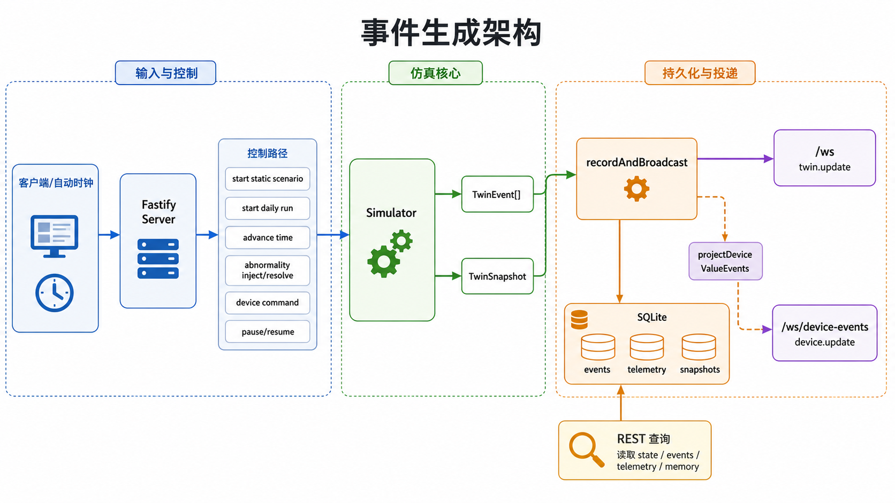

# 事件生成流程

本文面向第一次阅读 VirtualHome 的人，说明项目如何从家庭模板、场景计划、时间推进和设备控制中生成事件，并把这些事件转换成前端、接口和家庭 memory 可以使用的数据。

## 一句话总览

VirtualHome 维护一个“当前家庭状态”，每次模拟时间推进、场景步骤执行、设备被控制、规则被触发或传感器产生读数时，都会把状态变化记录成事件。内部会保存完整事件；对外给 memory 使用时，只投影成“哪个家、哪个房间、哪个设备、哪个字段、变成了什么值、发生在什么时候”。

## 需要先理解的对象

| 对象 | 含义 | 如何生成 | 如何使用 |
| --- | --- | --- | --- |
| 家庭模板 | 家中有哪些房间、设备、设备能力、人员画像和初始状态 | 项目启动时从家庭定义加载 | 决定模拟世界的结构，也决定哪些设备能产生哪些状态和遥测 |
| 当前家庭状态 | 某一刻家中所有房间、人员、设备、告警、时间和运行上下文的快照 | 启动新 run 时初始化；之后由事件持续更新 | 前端展示、规则判断、传感器生成和持久化恢复都依赖它 |
| 场景计划 | 某一天或某个静态场景中，人和设备应发生的计划行为 | 由静态场景或每日生成逻辑创建 | 到达计划时间后推动人员移动、活动开始、设备状态变化等 |
| 原始事件 | 模拟内部记录的一次事实变化或系统输出 | 由时间推进、控制命令、自动化规则、传感器模型等产生 | 写入事件历史、更新快照、广播给前端；其中设备相关事件会被投影给 memory |
| 设备值事件 | 从原始设备事件中拆出来的单个字段变化 | 把设备遥测或设备状态事件按字段展开 | 是家庭 memory 和外部观察者最重要的输入 |
| 运行序号 | 同一个 run 内单调递增的事件位置 | 每创建一个原始事件都会前进 | 用于排序、断线续传、重放和判断客户端是否落后 |

## 从启动到运行的主流程

服务启动后会先建立一个模拟器和持久化数据库。它会尝试从最近的兼容快照恢复；如果没有兼容快照，就启动一个新的每日 run。之后系统进入循环：外部请求或自动时钟推动模拟，模拟产生事件，事件被记录并广播。

主链路如下：

1. 加载家庭模板，得到房间、设备、人员和初始状态。
2. 创建或恢复当前家庭状态。
3. 等待输入：自动时钟、手动推进、启动场景、设备控制、异常注入、告警状态变更等。
4. 输入进入模拟器后，模拟器根据当前状态生成一个或多个原始事件。
5. 原始事件被追加到事件历史，并更新当前家庭状态。
6. 服务端把事件写入持久化存储。
7. 服务端把完整事件广播给通用前端视图。
8. 服务端把设备相关事件投影成设备值事件，广播给 device-events 订阅者和 memory。
9. REST 查询接口可以从持久化事件历史重建某个 run 的状态或 memory。

## 事件从哪里来

| 来源 | 触发方式 | 生成的数据 | 用途 |
| --- | --- | --- | --- |
| 每日 run | 服务启动或用户启动每日场景 | 一天内的人员活动、设备使用、环境变化计划 | 让家中行为更接近日常生活 |
| 静态场景 | 用户选择某个预设场景 | 固定步骤的人员移动、设备变化、对话或外部交互 | 用于可复现演示和测试 |
| 时间推进 | 自动时钟或手动推进分钟数 | 到期场景步骤、日常动态、规则输出、传感器读数 | 是持续生成事件的核心入口 |
| 设备控制 | 用户或外部调用控制设备 | 设备状态变化、可能的人员移动、告警恢复 | 模拟真实控制带来的设备状态更新 |
| 自动化和安全规则 | 状态满足规则条件 | 自动化触发、告警创建、规则恢复 | 模拟家庭系统的自动响应 |
| 传感器模型 | 每轮时间推进后扫描当前状态 | 设备遥测读数，例如运动、门磁、功率、温湿度 | 给外部观察者和 memory 提供可见数据 |
| 异常注入和恢复 | 用户注入漏水、网络故障等 | 异常状态、告警、恢复事件 | 用于测试异常情况下的家庭状态变化 |

## 每一分钟发生什么

自动时钟或手动推进会让模拟时间一分一分前进。每一分钟大致执行这些阶段：

1. 推进模拟时钟，并为后续事件分配新的时间位置。
2. 更新人员需求和计划活动，例如移动、做饭、学习、休息或娱乐。
3. 执行已经到时间的场景步骤。
4. 重新计算房间占用和房间环境，让后续规则看到最新状态。
5. 应用日常动态，例如家电生命周期、路由器状态、冰箱门、清扫设备、天气影响和安静模式。
6. 应用自动化与安全规则，例如睡眠模式、离家模式、漏水响应、开门告警、冰箱门长开告警和作业提醒。
7. 根据当前状态生成传感器和设备遥测。
8. 再次刷新聚合状态，并把本轮产生的事件追加到历史。

这个顺序很重要：传感器读数是在规则和状态变化之后生成的，所以它观察到的是“这一分钟处理完成后的家庭状态”。

## 外部天气和室内环境如何影响事件

每日场景会从外部上下文中得到日期、季节、天气类型、室外温度和降水量。季节会决定当天的初始室内环境基线，天气会在每一分钟继续影响各房间温度和湿度。

| 影响来源 | 作用方式 | 会产生什么事件 |
| --- | --- | --- |
| 室外天气 | 根据室外温度、正午日照和房间类型，让室内温度向一个天气目标缓慢漂移 | 后续温湿度遥测会反映房间环境变化 |
| 房间有人 | 有人且空调未开启时，房间会有轻微人体热量增益 | 如果温度超过舒适阈值，可能触发空调规则 |
| 空调 | 客厅、主卧和儿童房有空调；有人且过热或过冷时会自动调节 | 产生空调设备状态变化和 room_climate_comfort 自动化事件 |
| 厨房灶具 | 灶具功率会作为厨房热源进入房间环境，而不是在传感器采样时无限叠加 | 厨房温度随做饭升高，灶具关闭后不再继续加热 |
| 油烟机和自然回落 | 灶具关闭后，厨房会向天气目标回落；油烟机开启时回落更快 | 后续温湿度遥测显示厨房热量衰减 |
| 冰箱门长开 | 冰箱门长开会增加厨房温漂和压缩机功耗 | 产生冰箱状态变化、厨房温度变化和告警升级 |

温湿度传感器仍然是观测层：房间状态保存的是模拟世界的当前温度，传感器事件会上报带有滞后和噪声的读数。这样 UI 和规则可以使用稳定 world state，同时 memory 看到的是更接近真实设备上报的观测值。

## 原始事件包含什么数据

内部原始事件是系统的完整事实记录。不同事件类型有不同业务字段，但都带有一组通用运行字段。

| 字段 | 含义 | 如何生成 | 如何使用 |
| --- | --- | --- | --- |
| id | 事件唯一标识 | 创建事件时分配 | 持久化、追踪来源、投影设备值事件 |
| runId | 当前模拟运行 ID | 每次启动新 run 时生成 | 区分不同模拟运行，客户端 run 切换时重置 memory |
| sequence | run 内单调递增序号 | 每个事件创建时递增 | 排序、断线续传、历史回放 |
| ts | 服务端真实时间 | 事件创建时取当前真实时间 | 持久化、审计、前端显示真实接收时间 |
| simTime | 模拟世界时间 | 由模拟时钟决定 | 日常节律、morning/daytime/evening/night 判断 |
| homeId | 家庭 ID | 来自家庭模板 | 区分家庭，传递给前端和 memory |
| scenarioId | 内部场景 ID | 场景事件可能携带 | 仅用于内部追踪；不会出现在 device-events 的设备值事件里 |
| sourceLayer | 来源层 | 根据事件来源归类 | 区分真实行为、设备世界、传感器、控制和推断输出 |
| lineage | 事件血缘元数据 | 创建事件时生成 | 说明观测时间、摄入时间、可观测性和版本信息 |

sourceLayer 可以帮助理解事件可信层级：

| 来源层 | 含义 | 示例 |
| --- | --- | --- |
| truth | 模拟内部的家庭真值行为 | 人员移动、活动开始、对话、外部交互 |
| world | 设备或物体状态变化 | 设备状态改变、物体移动 |
| sensor | 传感器或设备遥测 | 运动、功率、温湿度、门磁读数 |
| control | 用户或系统控制 | 启动场景、注入异常、改变告警状态 |
| inference | 规则和自动化输出 | 自动化触发、告警创建、规则恢复 |

## 设备状态事件和设备遥测事件

设备相关事件分两类，它们都会被投影给 memory。

| 类型 | 含义 | 数据来源 | 典型字段 | 下游用途 |
| --- | --- | --- | --- | --- |
| 设备状态变化 | 设备真实状态被改变 | 设备控制、场景步骤、自动化规则、异常处理 | state 中的 power、lock、doorOpen、mode 等 | 表示设备实际变成了什么状态 |
| 设备遥测 | 传感器或设备上报的观测值 | 传感器模型扫描当前家庭状态 | measurements 中的 motion、powerW、temperature、humidity、co2 等 | 表示外部可观察到的设备读数 |

设备状态变化更接近“世界状态改变”，设备遥测更接近“传感器看到的值”。家庭 memory 主要关心两者投影后的字段值，而不是内部是谁触发了它。

## device-events 如何生成

device-events 是给外部观察者和 memory 使用的窄视图。它不会发送完整原始事件，也不会发送场景 ID、人员真值、控制原因或自动化细节。

生成规则是：

1. 只选择设备遥测和设备状态变化两类原始事件。
2. 对设备遥测，把 measurements 里的每个字段拆成一条设备值事件。
3. 对设备状态变化，把 state 里的每个字段拆成一条设备值事件。
4. 每条设备值事件只保留设备、房间、字段、值、时间、run 和来源标识。
5. 其它原始事件会被忽略，不进入家庭 memory 的输入流。

这意味着一个原始设备事件如果同时包含多个字段，会被拆成多条设备值事件。例如一个设备同时上报 powerW 和 online，会变成两条独立记录。

## 设备值事件字段说明

| 字段 | 含义 | 如何生成 | 如何使用 |
| --- | --- | --- | --- |
| id | 设备值事件 ID | 原始事件 ID 加字段名组合而成 | 作为 evidence ID，关联 semantic signal 和 UI 高亮 |
| sourceEventId | 原始事件 ID | 来自设备遥测或状态事件 | 用于追踪这条字段值来自哪个原始事件 |
| sourceEventType | 原始事件类型 | 来自设备遥测或设备状态变化 | 区分这是遥测读数还是状态变化 |
| runId | 所属模拟运行 ID | 继承原始事件 | 客户端判断是否需要重置 memory |
| sequence | 原始事件序号 | 继承原始事件 | 排序、断线续传、最新事件选择 |
| ts | 真实时间 | 继承原始事件 | first seen、last seen、episode 时间 |
| simTime | 模拟时间 | 继承原始事件 | 时间段归类、日/周摘要、画像节律 |
| homeId | 家庭 ID | 继承原始事件 | 标识这条事件属于哪个家庭 |
| roomId | 房间 ID | 继承原始事件 | 建立 room memory、判断生活区域 |
| deviceId | 设备 ID | 继承原始事件 | 建立 device memory、field memory 和图谱节点 |
| deviceType | 设备类型 | 继承原始事件 | 判断证据类型和 semantic signal 类型 |
| field | 被观察或改变的字段名 | 来自 measurements 或 state 的字段 | 建立字段 memory、识别 episode 和语义 |
| value | 字段的新值 | 来自 measurements 或 state 的值 | 判断状态变化、当前值、数值范围和语义强度 |

## 持久化和广播

每次模拟产生事件后，服务端会同时做几件事：

| 去向 | 保存或发送什么 | 用途 |
| --- | --- | --- |
| events 历史 | 完整原始事件 | 支持回放、REST 查询和恢复 |
| telemetry 历史 | 设备遥测事件 | 支持遥测查询和保留策略 |
| snapshots | 周期性家庭状态快照 | 服务重启后恢复模拟状态 |
| idempotency records | 幂等请求和响应 | 让控制类请求安全重试 |
| access audit | 敏感接口访问记录 | 记录 memory 和观测接口访问 |
| 通用 WebSocket | 隐私投影后的完整 twin 更新 | 给主前端显示家庭状态 |
| device-events WebSocket | 设备值事件 | 给 memory、adapter 和外部观察者使用 |

## 重连和历史补放

device-events 支持客户端带着 runId 和 sequence 重连。服务端会从持久化事件历史中扫描该序号之后的事件，并再次投影成设备值事件。

| 情况 | 服务端行为 | 客户端行为 |
| --- | --- | --- |
| runId 仍然匹配 | 返回缺失的设备值事件 | 继续 reduce 到当前 memory |
| runId 已切换 | 发送 run_changed | 客户端清空 memory 并从新 run 重新开始 |
| 缺失历史太多 | 标记 replayComplete 为 false | 客户端保留已处理部分并快速重连 |

## 边界和保证

- 同一个 run 内 sequence 单调递增。
- device-events 不包含 scenarioId、人员真值、控制原因或自动化内部原因。
- 家庭 memory 的输入只来自设备值事件，不直接读取人员行为真值。
- 完整原始事件仍会在内部保存，因此系统可以用于调试、回放和通用前端展示。
- 设备值事件是隐私更窄的观测层，适合模拟真实应用中“只能拿到设备状态变更和房间信息”的场景。
