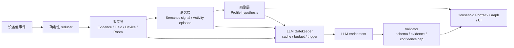

# Home Memory 中的 LLM 参与、可靠性证明和家庭画像层级

本文解释 VirtualHome 的 Home Memory 如何在保持可重放、可审计的前提下引入 LLM。它基于当前实现，以及 [家庭 Memory 处理流程](./home-memory-processing-flow.md) 中定义的事件、证据、语义、画像和图谱链路。

核心结论是：LLM 不替代底层 reducer，也不生成事实。LLM 只作为证据锁定的增强层，用来补充语义候选、画像解释、可靠性审稿、查询计划和高层画像摘要。

## 一句话总览

Home Memory 只消费设备值事件。确定性 reducer 先把事件变成 facts、evidence、field/device/room memory、episode、daily/weekly summary、semantic signal 和 profile hypothesis。LLM 只能在这些稳定中间产物之后参与，而且每个 LLM claim 都必须引用已有 evidence ID。



当前代码中，LLM 相关能力集中在 `src/sim/llm/homeMemoryEnrichment.ts`、`src/server/memoryQuery.ts` 和 Home Memory UI 的 `LLM Trace` 面板里。服务端默认不启用远程 LLM；只有配置 `HOME_MEMORY_LLM_ENABLED=true` 且提供 `HOME_MEMORY_LLM_BASE_URL` 时才会尝试 provider 调用。未启用或失败时，系统使用 deterministic fallback。

## 1. 哪些抽取层可以让 LLM 参与

Home Memory 的抽取层可以分为三类：

1. 不能让 LLM 介入的事实层。
2. 可以让 LLM 提候选、但不能自动落事实的语义层。
3. 很适合 LLM 参与解释和审稿的画像层。

### 不调用 LLM 的层

这些层必须保持确定性，因为它们是事实账本和可重放能力的基础。

| 层 | 当前职责 | 为什么不能交给 LLM |
| --- | --- | --- |
| device value event 展开 | 保存 homeId、runId、roomId、deviceId、field、value、simTime、sequence | 这是原始事实输入，必须稳定 |
| runId 校验 | run 切换时重置 HomeMemory | 防止不同 run 的证据混杂 |
| time bucket | 把 simTime 归为 morning/daytime/evening/night | 规则简单且需要可重放 |
| capability baseline | 根据 deviceType/field/value 得到 presence、climate、water、system 等能力 | 下游 evidence 和 semantic 都依赖它 |
| MemoryEvidence | 记录 category、strength、profileWeight、reason、evidence ID | 所有画像 claim 都要能回溯到 evidence |
| Field memory | 当前值、上一值、变化次数、数值范围、布尔统计、近期 evidence | 最低层事实记忆 |
| Device / Room / Home 聚合 | 事件数、设备/字段列表、时间分布、画像权重 | 图谱基础节点依赖这些聚合 |
| 3D graph base nodes/edges | home、room、device、field、semantic、hypothesis 的确定性投影 | 图谱展示不能改变底层 memory |

这些层即使没有 LLM，也必须完整运行。当前实现也遵守这个边界：LLM 增强层不在实时 reducer 的同步路径上。

### 可以让 LLM 参与的层

LLM 的价值在于处理规则不容易覆盖的语义归纳和自然语言解释。当前实现支持这些 purpose：

| 抽取点 | LLM 作用 | 当前输出 / API | 约束 |
| --- | --- | --- | --- |
| unknown schema mapping | 对未知 deviceType/field 提出 capability 或 semantic 候选 | `unknown_schema_mapping`，`GET /api/memory/schema-mappings?includeLlmEnrichment=true` | 不修改规则库，只给候选和人工 review 依据 |
| semantic candidate | 对稳定 evidence window 给出候选语义解释 | `semantic_candidate`，`GET /api/memory/semantic-candidates?includeLlmEnrichment=true` | 不写入 `memory.semanticSignals`，只作为候选 |
| hypothesis explanation | 把已有 hypothesis、evidence、white-box trace 转成解释文本 | `hypothesis_explanation`，`GET /api/memory/profile/hypotheses?includeLlmEnrichment=true` | 不能提高 baseline confidence |
| reliability review | 对中等置信度 hypothesis 给出替代解释、缺失证据、反证建议 | `reliability_review`，`includeReliability=true` | 只审稿，不覆盖规则结论 |
| query planning | 为自然语言查询生成证据锁定的查询计划 | `query_planning`，`GET /api/memory/query-plan?question=...` | 执行仍走确定性查询 |
| portrait summary | 为日/周 Household Portrait 生成高层摘要 | `daily_portrait_summary`，`GET /api/memory/portrait?includeLlmEnrichment=true` | 必须引用 portrait 里的 evidence |

这些输出统一使用 `HomeMemoryLlmEnrichment` 结构，包含：

```ts
{
  purpose: 'semantic_candidate' | 'reliability_review' | ...;
  claim: string;
  confidence: number;
  supportingEvidenceIds: string[];
  contradictingEvidenceIds: string[];
  missingEvidence: string[];
  alternatives: Array<{
    claim: string;
    confidence: number;
    evidenceIds: string[];
  }>;
}
```

### 调用时机和成本控制

LLM 不按单条设备事件调用。调用发生在信息形成稳定窗口之后，或由用户显式请求。

| 时机 | 是否调用 | 原因 |
| --- | --- | --- |
| 单条 device event 到达 | 不调用 | 成本高，且证据太稀疏 |
| reducer 更新 facts/evidence | 不调用 | 必须保持同步确定性 |
| 已知规则能识别 semantic | 不调用 | 规则足够时不需要 LLM |
| 未知 schema 重复出现达到阈值 | 可调用 | 适合生成候选映射 |
| 中等置信度 hypothesis | 可调用 | 适合 review alternatives 和 missing evidence |
| 用户点击解释/刷新 LLM Trace | 可调用 | 用户触发，成本可预期 |
| 日/周画像总结 | 可批处理调用 | 稳定窗口，适合缓存 |
| 图谱重绘 | 不调用 | 只展示已有 memory/enrichment |

当前实现有四层成本控制：

- **Gatekeeper**：根据 provider 是否启用、trigger、evidenceIds、cache、budget、confidence band 决定是否调用。
- **Cache**：cache key 包含 purpose、homeId、runId、target/hypothesis、evidenceIds hash、model、promptVersion、schemaVersion。
- **Batch plan / batch execution**：`/api/memory/llm/batch-plan` 只规划不调用；`POST /api/memory/llm/batch` 才执行，且逐项校验，单项失败不会影响其它项。
- **Provider lane**：所有真正进入 provider 的 JSON 和 stream 请求共享一条全局串行通道。同一时刻最多只有一个 LLM provider 调用在执行；其它调用会排队，并在服务端日志中输出 `provider_lane_queued`、`provider_lane_start` 和 `provider_lane_finish`。

前端 Home Memory 页面目前有 `LLM Trace` 面板：

- 自动读取 metrics 和 batch plan。
- 点击 Refresh 才请求可能触发 provider 的 explanation / review / portrait summary。
- 展示 `llm`、`cache`、`deterministic-fallback`、`planned`、`skipped` 等来源。
- 展示每个 LLM purpose 的触发条件、期望输出和产品目的，方便演示时说明“这次调用到底让模型做什么”。

### 演示时解释 LLM purpose

当领导问“为什么这里要调用大模型”时，可以按下面的口径解释。关键点是：LLM 只解释、审稿或提候选，不接管事实计算。

| Purpose | 什么时候触发 | 让 LLM 输出什么 | 演示时可以怎么说 |
| --- | --- | --- | --- |
| `hypothesis_explanation` | 用户刷新 LLM Trace，或对选中 hypothesis 开启 stream | 基于已有 hypothesis 和 evidence IDs 的自然语言解释 | “规则已经算出了这个 hypothesis。这里让 LLM 帮我们把证据链讲清楚，但它不能新增事实，也不能提高原始置信度。” |
| `reliability_review` | 刷新 LLM Trace 且请求 reliability；只针对中等置信度区间 | 缺失证据、反证、替代解释和审稿意见 | “这里不是让 LLM 下结论，而是让它质疑当前结论，指出还缺什么证据。” |
| `daily_portrait_summary` | 请求带 LLM enrichment 的 household portrait，或 batch 执行画像摘要 | 对已计算 portrait section 的高层摘要 | “画像已经由规则层形成。LLM 只把这些画像片段组织成更适合人读的总结。” |
| `semantic_candidate` | 稳定 evidence window 进入候选 batch | 某段证据窗口可能代表的语义候选 | “这只是候选解释，不会直接写回 memory。它帮助我们发现规则库还没有覆盖的模式。” |
| `unknown_schema_mapping` | 未知 deviceType/field 重复出现并达到阈值 | 未知字段可能对应的 capability 或 semantic 类型 | “设备字段我们还不认识时，LLM 给一个映射建议，后续仍需要规则或人工确认。” |
| `query_planning` | 用户发起自然语言 memory 查询 | 证据锁定的查询计划 | “LLM 翻译用户意图，但实际查询仍由确定性代码执行，避免模型直接读写 memory。” |

流式输出只用于观察 provider 正在返回什么。前端会实时显示 `provider_delta`，但系统不会因为某个 delta 立刻采纳结论；后端会等完整 JSON 收齐后，再做 schema 校验、evidence boundary 校验和 confidence cap 校验。只有全部通过，结果来源才会标记为 `llm`；否则会退回 deterministic fallback。

## 2. 如何证明家庭图谱可靠

家庭图谱不是新的真值来源，而是 HomeMemory 的展示投影。因此可靠性要按层证明：事实层、语义层、画像层、图谱结构层和 LLM 层分别有可测指标。

### 事实层：重放一致性

事实层要证明同一批事件历史在同一 reducer 版本下会得到同一份 memory 和同一张图谱。

```text
same events + same reducer version
=> same HomeMemory hash
=> same graph node/edge hash
=> same hypothesis hash
```

可用指标：

| 指标 | 含义 |
| --- | --- |
| Replay determinism rate | 同一 run 重放多次，memory hash 一致比例 |
| Event coverage | 进入 graph / hypothesis 的 evidence 是否都能追溯到原始 device value event |
| Sequence consistency | latest evidence 是否遵守 sequence 和 simTime 顺序 |
| Run isolation | run 切换后是否没有旧 run 的 evidence、node、hypothesis 残留 |

当前服务端 memory 查询从持久化事件历史重建目标 run 的 HomeMemory，而不是读取浏览器状态，这使 replay 验证可行。

### 语义层：标注集和负例

语义层要证明 semantic signal 的 precision、recall 和 abstention。尤其要证明系统不会把弱信号强行解释成家庭行为。

建议建立 golden set：

```text
device value event window
=> expected evidence category
=> expected semantic signal
=> expected activity episode
```

必须保留的负例：

| 负例 | 预期 |
| --- | --- |
| 单条厨房事件 | 不强推 household size |
| 高频温湿度、CO2、PM2.5 | 只作为 environment context，不作为强人类活动 |
| battery、online、firmware、signal | 只作为 system/fact，不进入画像 |
| 自动化设备运行 | 不直接等价为人在家 |
| 重复值上报 | 不反复提高画像权重 |
| 新设备/未知字段 | 可以产生 LLM candidate，但不能污染规则库 |

可用指标：

| 指标 | 含义 |
| --- | --- |
| Precision | 被抽成某类 semantic 的事件中，多少是真的 |
| Recall | 应该被抽成某类 semantic 的事件中，多少被抽中 |
| False positive by type | 哪些语义类型最容易误判 |
| Abstention quality | 模糊事件是否能保持 weak/unknown，而不是强行解释 |
| Evidence-link correctness | 每个 semantic signal 是否能回指正确 evidence IDs |

### 画像层：概率校准

家庭画像不是单个确定真值，很多输出是概率假设。例如 household size 输出的是候选分布、下界、置信度和缺失证据，而不是“确认几人”。

可用指标：

| 指标 | 含义 |
| --- | --- |
| Calibration curve | 置信度 0.7 的 hypothesis，长期看是否约 70% 正确 |
| Brier score | 概率分布质量，尤其适合 household_size |
| Top-1 / Top-2 accuracy | 最可能候选或前两个候选是否命中 |
| Lower-bound violation rate | 推出的 lowerBound 是否超过真实人数 |
| Confidence under sparse evidence | 稀疏证据时置信度是否自动被 cap |
| Contradiction rate | 互相矛盾的画像是否被标记或降权 |

当前 hypothesis 和 portrait 都保留 evidenceIds、missingEvidence、contradictingEvidence 和 confidence，这让画像可以被审计，而不是只展示一个结论。

### 图谱层：结构 invariant

图谱可靠性可以用硬约束自动检查。

```text
Hypothesis
  -> supporting subject / semantic
  -> Field
  -> Device
  -> Room
  -> Home
```

可用 invariant：

| Invariant | 失败说明 |
| --- | --- |
| No orphan hypothesis | 有画像节点但没有支撑主体 |
| No orphan semantic | 有语义节点但无法追溯到 field |
| No edge to missing node | 边指向不存在节点 |
| Evidence chain complete | hypothesis 到 evidence 的链路断裂 |
| Confidence monotonicity | 弱证据不应产生高置信度结论 |
| Environment-only cap | 只有环境遥测时，presence/household_size 置信度必须低 |

当前实现提供 `/api/memory/reliability`，返回 factLayer、semanticLayer、portraitLayer 和 graphLayer 指标，包括 eventCoverage、runIsolation、evidenceLinkCorrectness、orphan counts、missing evidence reference、confidence monotonicity violations 和 environment-only cap violations。

### LLM 层：证据锁定和回退率

LLM 层要证明的是：LLM 没有把系统从可审计变成黑箱。

当前 validator 会拒绝这些输出：

- 没有 supporting evidence ID 的 claim。
- 引用不存在的 evidence ID。
- 跨 home 或跨 run 引用 evidence。
- 把概率假设写成确定事实的 claim。
- 尝试让 LLM confidence 高于 baseline hypothesis confidence。
- 违反 schema 的 JSON。

可用指标：

| 指标 | 含义 |
| --- | --- |
| Unsupported claim rate | 没有 evidence 支撑的 claim 比例，目标为 0 |
| Cache hit rate | 同一 evidence window 是否复用结果 |
| Calls per home per hour/day | 是否受预算约束 |
| Average tokens per purpose | 成本分布 |
| Validation rejection rate | provider 输出被拒绝比例 |
| Fallback rate | disabled、失败、预算耗尽时走 deterministic fallback 的比例 |
| User-triggered vs background-triggered ratio | 成本是否主要由显式请求触发 |

这些数据通过 `/api/memory/llm/metrics` 暴露，前端 `LLM Trace` 面板也会显示 cache hit、fallback、validation rejection 和 budget 使用。

## 3. 最高层家庭画像包含哪些类别和层次

最高层家庭画像建议使用四级结构：

```text
Level 0: Evidence-backed facts
Level 1: Semantic activity patterns
Level 2: Household profile dimensions
Level 3: Cross-dimensional household portrait
```

### Level 0：事实与证据层

这层不是“画像结论”，但它是画像可靠性的基础。

| 类别 | 内容 |
| --- | --- |
| 房间事实 | 房间内设备、活跃字段、事件计数、时间段分布 |
| 设备事实 | 最新状态、字段列表、事件数、画像权重 |
| 字段事实 | 当前值、上一值、变化次数、数值范围、布尔统计 |
| 证据事实 | evidenceCategory、evidenceStrength、profileWeight、capability、reason |
| 时间事实 | simTime、timeBucket、daily summary、weekly summary |
| episode 事实 | occupancy、contact activity、device usage、appliance usage |

### Level 1：生活语义层

这层回答：设备事实像什么生活信号？

| 语义类型 | 含义 |
| --- | --- |
| presence_signal | 可能有人活动或在场 |
| access_signal | 入户、离家、门窗或入口活动 |
| sleep_signal | 睡眠或在床上下文 |
| water_signal | 用水活动 |
| cooking_signal | 做饭、备餐、厨房活动 |
| media_signal | 娱乐或共享媒体活动 |
| work_study_signal | 工作或学习活动 |
| lighting_signal | 活动背景照明 |
| climate_signal | 主动气候调节 |
| environment_signal | 温湿度、空气质量等弱背景 |
| system_signal | 设备健康或系统状态，不参与画像 |

LLM 可以在这一层提供 candidate，但不能直接写入确定性 semantic baseline。

### Level 2：画像维度层

当前 `ProfileHypothesisType` 已覆盖这些画像维度：

| 画像维度 | 当前类型 | 说明 |
| --- | --- | --- |
| 家庭组成 | `household_size`、`resident_slot` | 可能几人、是否存在匿名生活槽位 |
| 日常节律 | `daily_rhythm`、`routine_window` | 早/午/晚/夜活跃规律 |
| 房间习惯 | `room_habit` | 某房间通常在哪些时段活跃 |
| 房间功能 | `room_function` | 厨房、睡眠区、工作区、娱乐区、入口区等 |
| 设备例程 | `device_routine` | 多设备使用模式 |
| 设备贡献 | `device_contribution` | 哪些设备最能解释家庭活动 |
| 活动模式 | `activity_cluster` | 备餐、娱乐、工作学习、睡眠、卫生等 |
| 行为流程 | `behavior_flow` | 回家后路径、睡前流程、备餐流程等 |
| 当前在家可能性 | `presence_signal` | 最近是否可能有人活动 |
| 状态异常 | `state_anomaly` | 环境异常但没人响应、设备噪声、证据冲突 |

每个 hypothesis 都应包含：

- `confidence`
- `evidence`
- `supportingEvidence`
- `contradictingEvidence`
- `missingEvidence`
- `updatedAt`
- 关联 subject IDs

### Level 3：跨维度 Household Portrait

最高层不应该只是 hypothesis 列表，而应该是稳定 section，方便 UI、agent 和报告使用。当前实现中的 Household Portrait section 包括：

| Section | 解释 |
| --- | --- |
| Household composition | 家庭组成、人数概率、resident slots |
| Daily rhythm | 活跃时间段和日常节律 |
| Room functions | 房间功能画像 |
| Routine patterns | 稳定活动时间窗和 routine |
| Behavior flows | 回家、睡前、备餐、气候响应等流程 |
| Device contribution | 对画像贡献最高的设备 |
| Current presence / recency | 最近 activity 和 presence 可能性 |
| Anomalies and uncertainty | 状态异常、矛盾证据、不确定性 |
| Evidence quality | 证据数量、独立设备、房间覆盖、日/周覆盖、缺失证据 |

每个 section 必须保留：

```ts
{
  confidence: number;
  evidenceIds: string[];
  missingEvidence: string[];
  contradictingEvidenceIds: string[];
  updatedAt: string | null;
  explanationSource: 'rule_template' | 'llm_enrichment' | 'mixed';
}
```

这样最高层家庭画像既可以给用户读，也可以给外部 agent 用；同时仍然能向下回溯到 evidence、semantic、field/device/room 和原始设备值事件。

## 当前实现边界

当前实现已经具备这些能力：

- LLM provider 配置：`HOME_MEMORY_LLM_BASE_URL`、model、timeout、retry、预算。
- LLM gatekeeper：阻止单条 device event、cache 命中、预算耗尽、证据不足等调用。
- Validator：schema、evidence ID、home/run、confidence cap。
- Cache：内存缓存和 SQLite 持久化缓存。
- API：hypothesis enrichment、reliability review、schema mapping、semantic candidate、query plan、portrait、batch plan、batch execution、metrics。
- UI：Home Memory 的 `LLM Trace` 面板展示 provider 参与、fallback、cache、batch gatekeeper 和 metrics。

还应继续坚持的边界：

- LLM 不修改 reducer。
- LLM 不生成设备事件。
- LLM 不写人员真值。
- LLM 不绕过 evidence。
- LLM 不提高 baseline hypothesis confidence。
- LLM 失败时不影响 deterministic HomeMemory。

最终目标不是让 LLM “判断家庭真相”，而是让它在证据锁定的范围内帮助解释、审稿和总结，让家庭图谱既更容易理解，也仍然可追溯、可重放、可测试。
