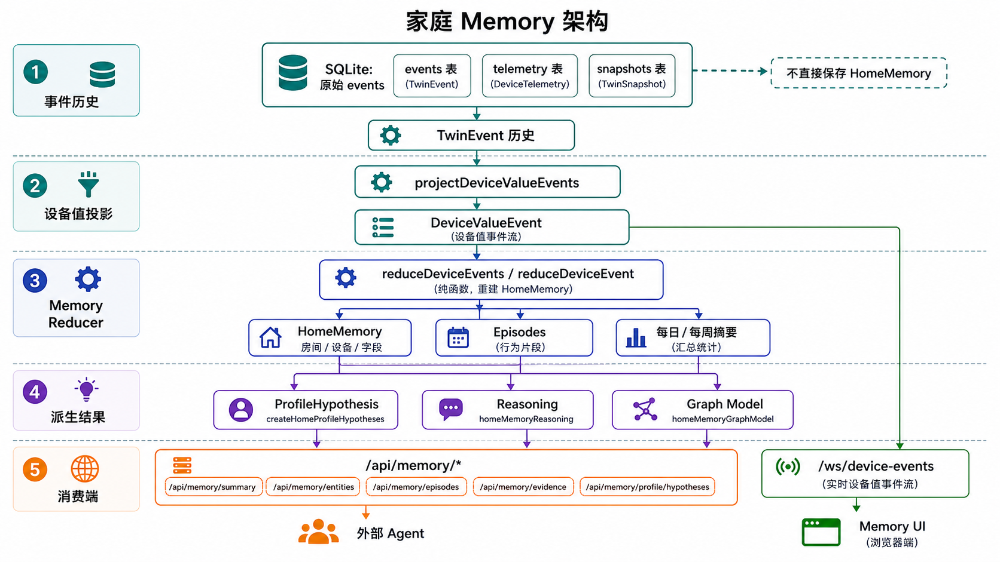
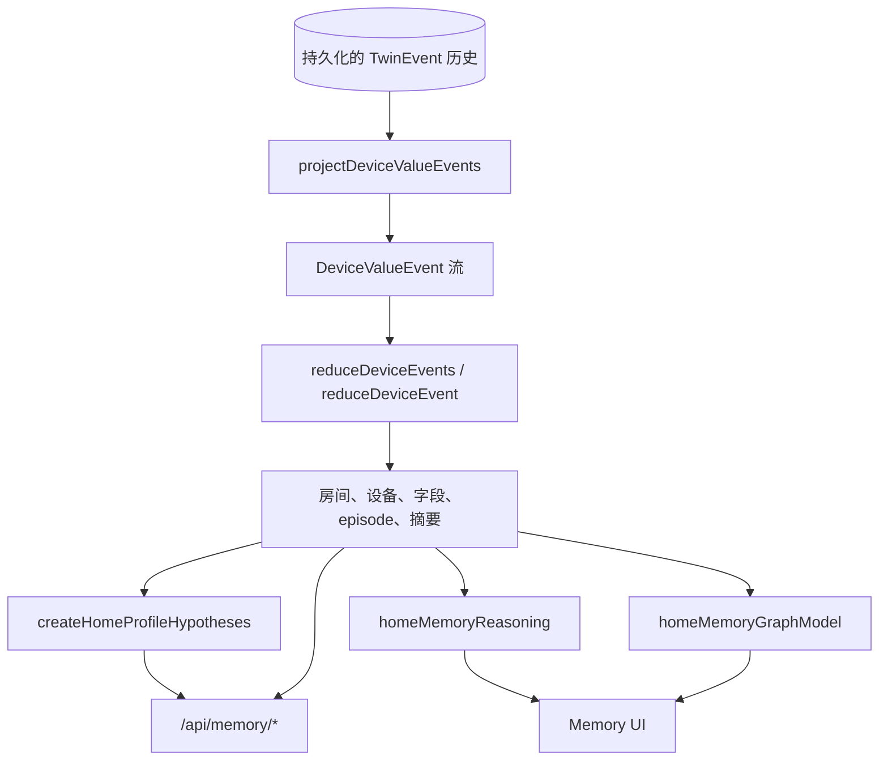
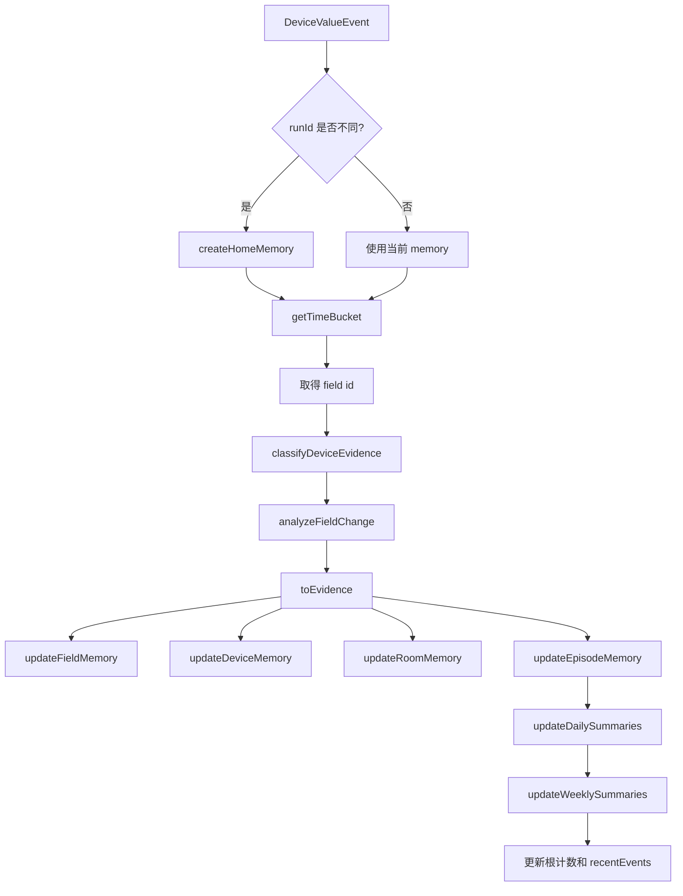
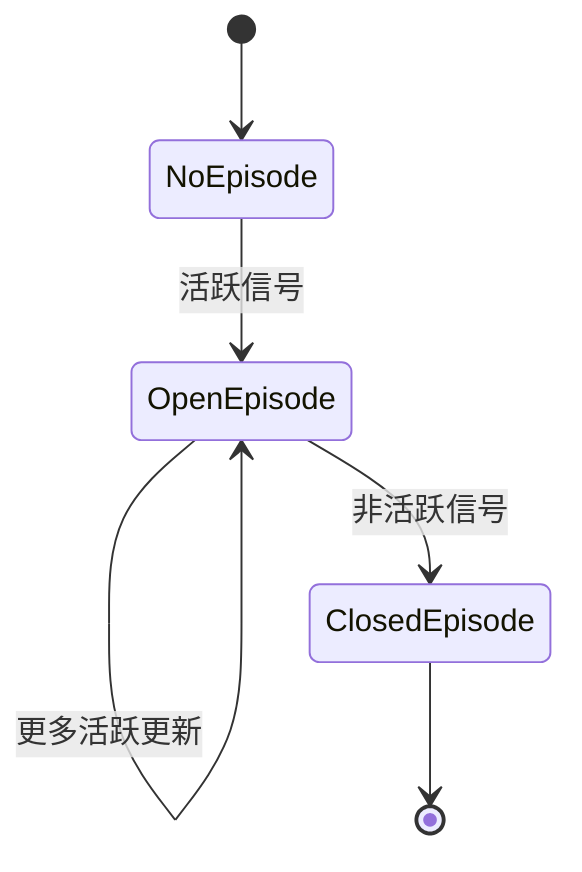
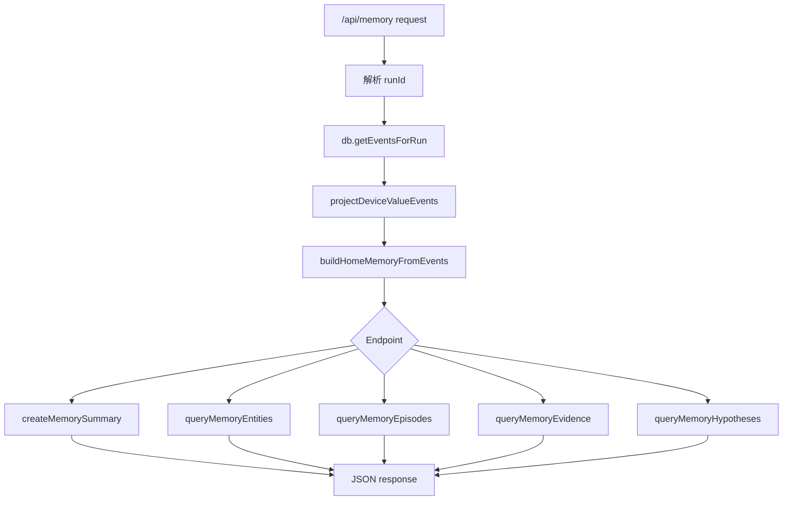

# 家庭 Memory 处理流程

本文说明 VirtualHome 如何把设备可观测事件转换成家庭 memory、画像假设、图视图和查询 API 响应。内容基于当前实现：`src/server/deviceEventStream.ts`、`src/web/homeMemoryModel.ts`、`src/web/homeProfiler.ts`、`src/web/homeHouseholdSizeEstimator.ts`、`src/web/homeMemoryReasoning.ts`、`src/server/memoryQuery.ts` 和 `src/web/HomeMemoryView.tsx`。



## 目标

家庭 memory 是供外部 agent 和 Memory UI 使用的设备可观测知识层。它由设备遥测和设备状态变化构建，不直接使用私密的家庭真值标签。浏览器端实时 memory 和服务端查询响应复用同一套 reducer。

## 总览流程



memory 模型有两个运行时消费者：

- 浏览器实时视图：`HomeMemoryView` 订阅 `/ws/device-events`，并把收到的批次 reduce 到 React state。
- 服务端查询 API：`memoryQuery.ts` 从 SQLite 读取某个 run 的事件，把它们投影成设备值事件，再 reduce 成 `HomeMemory`，最后返回筛选后的视图。

## 输入投影

家庭 memory 消费 `DeviceValueEvent` 记录：

```text
sourceEventId
sourceEventType: DeviceTelemetry | DeviceStateChanged
runId
sequence
ts / simTime
homeId
roomId
deviceId
deviceType
field
value
```

`projectDeviceValueEvents()` 会通过展开以下内容创建这些记录：

- `DeviceTelemetry.measurements`
- `DeviceStateChanged.state`

其他所有 `TwinEvent` 类型都会被家庭 memory 忽略。这是有意设计的：memory 应该代表 adapter 或外部 agent 能从设备与传感器数据中观察到的内容。

## Reducer 管线

`reduceDeviceEvent(memory, event)` 是核心 memory 更新逻辑。它是一个纯 reducer：返回新的 `HomeMemory` 对象，不修改传入的旧对象。



reducer 会更新以下 memory 层：

| 层级 | 保存内容 |
| --- | --- |
| 根 `HomeMemory` | `homeId`、`runId`、总事件数、近期 evidence、画像 evidence 总量、每日和每周摘要 |
| 房间 memory | 设备、活跃字段、计数、时间桶、近期事件、按类别聚合的 evidence 权重 |
| 设备 memory | 最新值、字段列表、计数、时间桶、近期事件、按类别聚合的 evidence 权重 |
| 字段 memory | 当前值和上一个值、有意义变化次数、遥测次数、数值 min/max、布尔 true/false 计数、近期事件 |
| Episode memory | 占用、接触活动、设备使用、家电使用等打开或关闭的行为片段 |
| 每日/每周摘要 | 长窗口内的活跃房间、设备、字段、有意义房间、时间桶和画像 evidence 总量 |

近期事件缓冲区有上限：

- 根、房间和设备近期事件最多保留 50 条。
- 字段近期事件最多保留 20 条。

## Evidence 分类

每个设备值都会转换成 `MemoryEvidence`。分类在聚合之前完成：

| 类别 | 示例 | 对画像的影响 |
| --- | --- | --- |
| `human_activity` | 门锁打开、人体移动信号 | 更强的画像 evidence |
| `device_usage` | 通电、接触打开、正向功率读数 | 行为或设备例程 evidence |
| `environment_context` | 温度、湿度、CO2、PM2.5、通用传感器 | 较弱的上下文 |
| `system_status` | 电池、固件、在线状态、信号强度 | 作为事实 memory 保存，但不参与画像推断 |

`analyzeFieldChange()` 判断一个值是否是有意义变化：

- 字段第一次被观测时是有意义的。
- 重复的相同值属于遥测，不是新的画像 evidence。
- 数值变化只要不是完全不变，就有意义。
- 环境类数值变化至少需要达到 `0.5` 的阈值。
- 无意义遥测仍然会更新事实 memory 和计数器，但画像权重为零。

## Episode 检测

Episode 会把重复的低层事件压缩成行为片段。



Episode 信号由字段和设备类型推导：

| 信号 | Episode 类型 |
| --- | --- |
| Motion、occupancy、occupied 等布尔字段 | `occupancy` |
| Contact、doorOpen、open、windowOpen 等字段 | `contact_activity` |
| 正向 `powerW`、wattage 或 current | `appliance_usage` |
| 布尔或字符串形式的 power/state 值 | `device_usage` |

每个 episode 会保存开始时间和更新时间、房间/设备/字段、evidence id、最新值、可选峰值、关闭后的持续时间，以及累计画像权重。

## 画像假设

`createHomeProfileHypotheses(memory)` 会从 memory 中推导可解释的高层假设：

```mermaid
flowchart TD
  Memory[HomeMemory] --> DailyRhythm[每日节律假设]
  Memory --> RoomHabit[房间习惯假设]
  Memory --> DeviceRoutine[设备例程假设]
  Memory --> Presence[存在信号假设]
  Memory --> HouseholdSize[家庭规模假设]
  DailyRhythm --> Hypotheses[ProfileHypothesis[]]
  RoomHabit --> Hypotheses
  DeviceRoutine --> Hypotheses
  Presence --> Hypotheses
  HouseholdSize --> Hypotheses
```

假设类型：

- `daily_rhythm`：按 morning、daytime、evening、night 聚合近期 evidence。
- `room_habit`：识别每个房间中最强的活动时间桶。
- `device_routine`：识别同时具有多个活跃设备且事件数足够的房间。
- `presence_signal`：使用近期有意义设备活动和行为 episode 作为较弱的在家 evidence。
- `household_size`：根据并发活动下界、睡眠区、日常 routine cluster、弱环境上下文占比、episode、每日摘要和每周摘要估计居住人数概率分布。

## 各类结论的推断逻辑

画像结论不是直接读取模拟真值，也不是把事件交给大模型总结。当前实现使用可解释规则从 `HomeMemory` 派生 `ProfileHypothesis`。每个结论都会保留 `evidence`、`subjectIds` 和 `confidence`，因此 UI 可以展示“这个结论从哪些房间、设备、字段和事件得来”。

### `daily_rhythm`

实现位置：`createDailyRhythms()`。

输入特征：

- `MemoryEvidence.timeBucket`，由 `simTime` 映射到 `morning`、`daytime`、`evening`、`night`。
- 当前 bucket 下的最近事件数量。
- 当前 bucket 涉及的房间集合。
- 每日摘要中有多少天命中过该 bucket。
- 每周摘要数量，用来提升跨周稳定性。
- bucket 内 evidence 的 `profileWeight` 总和。

推断方式：

1. 只要最近事件中出现某个时间桶，就为该时间桶创建节律假设。
2. 统计这个时间桶的事件数、房间数、加权 evidence、命中的天数和周数。
3. 用 `confidenceFromCount()` 根据“该时间桶信号 / 全局画像信号”计算置信度。
4. 样本很少时，`sampleSizeConfidenceCap()` 会限制最高置信度。

输出含义：

- 表示“家在某个时间段有稳定活动迹象”。
- 它不直接说明有几个人，只说明活动节律。

### `room_habit`

实现位置：`createRoomHabit()`。

输入特征：

- 房间级 `eventCount`。
- 房间级 `timeBuckets`，用于找到最强活动时间段。
- 房间内设备列表。
- 房间级 `profileEvidenceWeight`。
- 该房间中的行为 episode 数量。

推断方式：

1. 对每个有事件的房间创建一个房间习惯假设。
2. 从 `timeBuckets` 中选择事件最多的时间段作为 `strongestBucket`。
3. 把房间画像权重和 episode 数量合并成该房间的行为信号。
4. 用房间信号相对于全屋信号的比例计算置信度。

输出含义：

- 表示“某个房间最常在什么时间段活跃”。
- 例如 kitchen 在 morning 最强，可能是早餐或晨间设备使用。
- 这个结论仍是房间层面的，不会直接声明具体用户身份。

### `device_routine`

实现位置：`createDeviceRoutine()`。

触发条件：

- 房间内设备数 `>= 2`。
- 房间事件数 `>= 3`。

输入特征：

- 房间内活跃设备集合。
- 房间最强时间桶。
- 房间 `profileEvidenceWeight`。
- 全屋总事件数。

推断方式：

1. 只有多设备、足够事件的房间才会生成 device routine。
2. 结论描述该房间存在多设备活动，并标记最强时间段。
3. 置信度由房间画像权重和设备数量共同决定。

输出含义：

- 表示“某个房间出现稳定的多设备使用模式”。
- 它比单设备事件更可信，但仍不能直接等价为某个人的固定习惯。

### `presence_signal`

实现位置：`createPresenceSignal()`。

输入特征：

- 最近事件涉及的房间。
- `human_activity` 和 `device_usage` 这两类有意义 evidence。
- 行为 episode，例如 occupancy、contact activity、device usage、appliance usage。
- 有意义 evidence 的 `profileWeight`。

推断方式：

1. 如果有 `human_activity` 或 `device_usage`，再加上 episode，会生成较强 presence 描述。
2. 如果只有环境传感器上下文，例如温度、湿度、普通传感器遥测，则 presence 保持不确定。
3. 置信度由有意义 evidence 权重、episode 数和活跃房间数共同决定。

输出含义：

- 表示“最近可能有人在家或有行为活动”。
- 环境传感器可以作为上下文，但不会单独形成强 presence。

### `household_size`

实现位置：`createHouseholdSize()` 和 `estimateHouseholdSizeFromMemory()`。

这个结论现在输出的是概率估计，而不是单一范围。核心输出包括：

- `estimate`：最可能的人数，当前限制在 1-5。
- `lowerBound`：由并发活动或睡眠区推出来的最低人数。
- `distribution`：1-5 人的概率分布。
- `confidence`：样本量、证据强度和弱上下文比例共同约束后的置信度。
- `features`：用于解释的中间特征。

输入特征：

| 特征 | 来源 | 作用 |
| --- | --- | --- |
| 并发活动窗口 | 最近 evidence 按 10 分钟窗口聚合，统计同窗口活跃房间数 | 推断最低人数下界 |
| 睡眠区 | `sleep_sensor`、`inBed`、夜间 bedroom occupancy episode | 识别稳定睡眠位置，提升常住人口判断 |
| routine cluster | kitchen meal、study/work、living evening、bathroom hygiene、entry、child/main sleep | 识别不同生活模式是否共存 |
| 有意义房间数 | `human_activity`、`device_usage` 或 episode 支持的房间 | 衡量活动覆盖范围 |
| 长窗口房间数 | daily/weekly summary 中的 meaningfulRooms | 避免只看最近几十条事件 |
| 弱环境上下文占比 | `environment_context / profileEventCount` | 防止温湿度等高频传感器误判人数 |
| 行为 episode 数 | occupancy/contact/device/appliance episode | 把重复低层事件压缩成行为片段 |

推断步骤：

1. 先筛选用于人数推断的 evidence。强设备使用、人类活动直接参与；高 CO2、高 PM2.5、正向水流和睡眠传感器会作为占用上下文参与，但普通温湿度不会强行推人数。
2. 按 10 分钟窗口计算并发活动房间数。若同窗口有 3 个独立房间的强信号，则 `lowerBound` 至少为 3。
3. 收集睡眠区。多个稳定睡眠区会提高最低人数和分布中较高人数的概率。
4. 抽取 routine cluster。厨房用餐、书房工作、客厅晚间活动、浴室用水、入口活动、儿童/主卧睡眠等 cluster 会影响最可能人数。
5. 计算 1-5 人的打分，并归一化为概率分布。
6. 根据分布峰值选出 `estimate`。
7. 根据样本量、lower bound、弱环境上下文占比给 `confidence` 加上上限，避免少量事件看起来过于确定。

典型解释：

```text
Estimated 3 residents with lower bound 2 and 64% confidence.
Distribution 1:5%, 2:28%, 3:46%, 4:18%, 5:3%.
Evidence: 2-room concurrent activity lower bound; 2 recurring sleep zones; 4 routine clusters.
```

边界处理：

- 高频温湿度、普通环境遥测会被保存为事实 memory，但不会强推家庭人数。
- 单房间少量事件会保持低置信度。
- 多房间连续事件不一定代表多人；只有同一 10 分钟窗口内的独立房间活动才提高下界。
- 输出仍是概率画像，不是身份识别或真实人口确认。

每个假设包含：

- `id`
- `type`
- `label`
- `summary`
- `confidence`
- `updatedAt`
- `subjectIds`
- 支撑用 `evidence`

置信度会受到样本量上限约束，避免稀疏 evidence 看起来过于确定。

## 推理和图视图

Memory UI 额外提供两个派生视图：

- `homeMemoryReasoning.ts` 解释被选中的事件如何更新事实 memory、evidence 聚合和相关假设。
- `homeMemoryGraphModel.ts` 把 home、room、device、field 和 hypothesis 记录转换成图节点和边。

这些视图是展示模型，不会改变底层 memory 状态。

## 服务端查询 API

查询 API 实现在 `src/server/memoryQuery.ts`，并由 `src/server/app.ts` 注册路由。



接口如下：

| Endpoint | 用途 |
| --- | --- |
| `GET /api/memory/summary` | 面向外部 agent 的紧凑上下文 |
| `GET /api/memory/entities` | 支持筛选的房间、设备或字段 memory |
| `GET /api/memory/episodes` | 支持筛选的行为 episode |
| `GET /api/memory/evidence` | 支持筛选的近期 evidence |
| `GET /api/memory/profile/hypotheses` | 画像假设，可选择包含 evidence |

memory 查询读取会以 `ml-observation` 的形式写入访问审计。

## 持久化边界

当前家庭 memory 是事件溯源的，不会单独物化保存。

SQLite 会持久化：

- 原始 `events`。
- `telemetry` 中的 `DeviceTelemetry` 行。
- 周期性 `snapshots`。
- 幂等记录。
- 访问审计记录。

SQLite 当前不会持久化：

- 作为 JSON blob 的 `HomeMemory`。
- 物化后的房间/设备/字段 memory 行。
- 物化后的 episode。
- 物化后的画像假设。

这意味着每一次服务端 memory 查询都会通过回放持久化事件来重建目标 run 的 memory。这个设计让 reducer 变更后可以重新计算 memory，但长时间运行会使查询延迟随事件历史增长。

未来可以增加物化 memory 缓存，保存 `{ home_id, run_id, covered_sequence, updated_at, payload_json }`，并只在缓存覆盖的 sequence 落后于当前 run sequence 时重建。

## 浏览器实时流程

Memory UI 使用同一套数据模型，但通过实时事件获取输入：

```mermaid
flowchart TD
  WS["/ws/device-events"] --> Parse[parseDeviceEventSocketMessage]
  Parse --> Cursor[更新重连 cursor]
  Cursor --> Reduce[setMemory(current => reduceDeviceEvents(current, update.events))]
  Reduce --> Hypotheses[createHomeProfileHypotheses]
  Hypotheses --> Graph[createHomeMemoryGraphModel]
  Graph --> Render[HomeMemory3D 和面板]
```

当服务端报告 run 变化时，浏览器会重置 memory。如果 replay 不完整，UI 会显示警告，保留已经处理的部分批次，并重连继续追赶。

## Agent 使用方式

外部 agent 应该调用查询 API，而不是抓取浏览器状态：

1. 先调用 `/api/memory/summary`。
2. 使用 `/api/memory/entities` 检查房间、设备或字段。
3. 在采取行动前使用 `/api/memory/evidence?meaningfulOnly=true` 查看 evidence。
4. 当行为或家庭画像相关时，使用 `/api/memory/profile/hypotheses?includeEvidence=true`。
5. 把 `evidenceReason`、`profileWeight`、`confidence` 和支撑 evidence 当作解释材料，而不是绝对事实。
