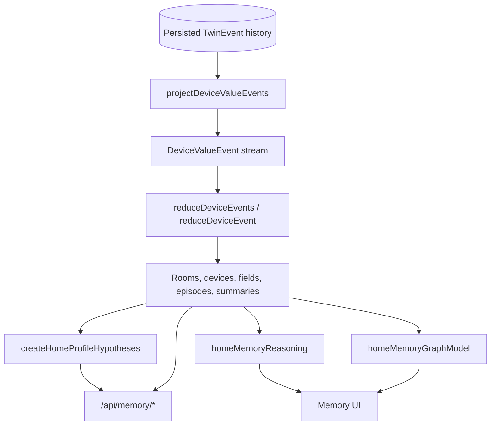
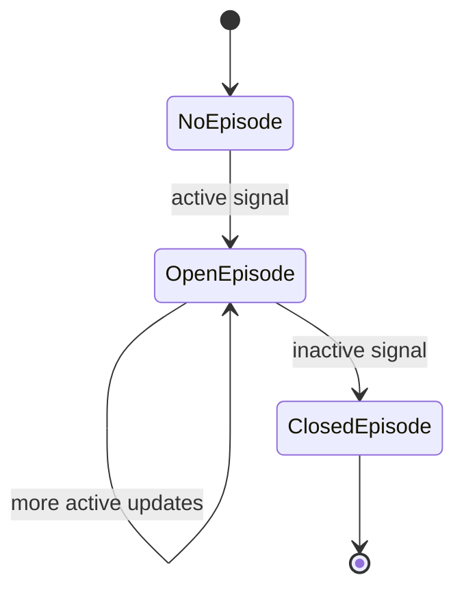

# Home Memory Processing Flow

This document describes how VirtualHome turns device-observed events into home memory, profile hypotheses, graph views, and query API responses. It is written from the current implementation in `src/server/deviceEventStream.ts`, `src/web/homeMemoryModel.ts`, `src/web/homeProfiler.ts`, `src/web/homeMemoryReasoning.ts`, `src/server/memoryQuery.ts`, and `src/web/HomeMemoryView.tsx`.

## Purpose

Home memory is the device-observed knowledge layer for external agents and the Memory UI. It is built from device telemetry and device state changes, not from private household truth labels. The same reducer powers browser-side live memory and server-side query responses.

## High-Level Flow



The memory model has two runtime consumers:

- Browser live view: `HomeMemoryView` subscribes to `/ws/device-events` and reduces incoming batches into React state.
- Server query API: `memoryQuery.ts` reads events for a run from SQLite, projects them into device value events, reduces them into `HomeMemory`, and returns filtered views.

## Input Projection

Home memory consumes `DeviceValueEvent` records:

```text
sourceEventId
sourceEventType: DeviceTelemetry | DeviceStateChanged
runId
sequence
ts / simTime
homeId
roomId
deviceId
deviceType
field
value
```

`projectDeviceValueEvents()` creates those records by flattening:

- `DeviceTelemetry.measurements`
- `DeviceStateChanged.state`

All other `TwinEvent` types are ignored by home memory. This is deliberate: memory should represent what an adapter or external agent could observe from device and sensor data.

## Reducer Pipeline

`reduceDeviceEvent(memory, event)` is the core memory update. It is a pure reducer: it returns a new `HomeMemory` object and does not mutate the previous one.


The reducer updates these memory layers:

| Layer | What it stores |
| --- | --- |
| Root `HomeMemory` | `homeId`, `runId`, total event count, recent evidence, profile evidence totals, daily and weekly summaries |
| Room memory | Devices, active fields, counts, time buckets, recent events, evidence weight by category |
| Device memory | Latest values, field list, counts, time buckets, recent events, evidence weight by category |
| Field memory | Current and previous values, meaningful change count, telemetry count, numeric min/max, boolean true/false counts, recent events |
| Episode memory | Open/closed behavior spans such as occupancy, contact activity, device usage, and appliance usage |
| Daily/weekly summaries | Long-window active rooms/devices/fields, meaningful rooms, time buckets, and profile evidence totals |

Recent event buffers are bounded:

- Root, room, and device recent events keep up to 50 items.
- Field recent events keep up to 20 items.

## Evidence Classification

Each device value becomes `MemoryEvidence`. Classification happens before aggregation:

| Category | Examples | Profile effect |
| --- | --- | --- |
| `human_activity` | Door unlock, motion signal | Stronger profile evidence |
| `device_usage` | Power on, open contact, positive power draw | Behavior/device routine evidence |
| `environment_context` | Temperature, humidity, CO2, PM2.5, generic sensors | Weak context |
| `system_status` | Battery, firmware, online, signal | Stored as fact memory but ignored for profile inference |

`analyzeFieldChange()` decides whether a value is a meaningful change:

- First observation of a field is meaningful.
- Repeated equal values are telemetry, not new profile evidence.
- Numeric deltas are meaningful unless unchanged.
- Environment numeric deltas need a threshold of at least `0.5`.
- Non-meaningful telemetry still updates fact memory and counters, but adds zero profile weight.

## Episode Detection

Episodes compress repeated low-level events into behavior spans.



Episode signals are derived from field and device type:

| Signal | Episode kind |
| --- | --- |
| Motion, occupancy, occupied boolean fields | `occupancy` |
| Contact, doorOpen, open, windowOpen fields | `contact_activity` |
| Positive `powerW`, wattage, or current | `appliance_usage` |
| Boolean or string power/state values | `device_usage` |

Each episode stores start and update times, room/device/field, evidence ids, latest value, optional peak value, duration when closed, and accumulated profile weight.

## Profile Hypotheses

`createHomeProfileHypotheses(memory)` derives explainable high-level hypotheses from memory:

```mermaid
flowchart TD
  Memory[HomeMemory] --> DailyRhythm[Daily rhythm hypotheses]
  Memory --> RoomHabit[Room habit hypotheses]
  Memory --> DeviceRoutine[Device routine hypotheses]
  Memory --> Presence[Presence signal hypothesis]
  Memory --> HouseholdSize[Household size hypothesis]
  DailyRhythm --> Hypotheses[ProfileHypothesis[]]
  RoomHabit --> Hypotheses
  DeviceRoutine --> Hypotheses
  Presence --> Hypotheses
  HouseholdSize --> Hypotheses
```

Hypothesis types:

- `daily_rhythm`: groups recent evidence by morning, daytime, evening, and night.
- `room_habit`: identifies strongest activity buckets per room.
- `device_routine`: identifies rooms with multiple active devices and enough events.
- `presence_signal`: uses recent meaningful device activity and behavior episodes as weak presence evidence.
- `household_size`: estimates a broad resident range from meaningful rooms, episodes, daily summaries, and weekly summaries.

Each hypothesis includes:

- `id`
- `type`
- `label`
- `summary`
- `confidence`
- `updatedAt`
- `subjectIds`
- supporting `evidence`

Confidence is capped by sample size to prevent sparse evidence from appearing too certain.

## Reasoning and Graph Views

The Memory UI adds two derived views:

- `homeMemoryReasoning.ts` explains how a selected event updates fact memory, evidence aggregates, and related hypotheses.
- `homeMemoryGraphModel.ts` turns home, room, device, field, and hypothesis records into graph nodes and edges.

Those views are presentation models. They do not change the underlying memory state.

## Server Query API

The query API is implemented in `src/server/memoryQuery.ts` and routed from `src/server/app.ts`.


Endpoints:

| Endpoint | Purpose |
| --- | --- |
| `GET /api/memory/summary` | Compact context for external agents |
| `GET /api/memory/entities` | Room, device, or field memory with filters |
| `GET /api/memory/episodes` | Behavior episodes with filters |
| `GET /api/memory/evidence` | Recent evidence with filters |
| `GET /api/memory/profile/hypotheses` | Profile hypotheses, optionally with evidence |

Memory query reads are recorded in the access audit as `ml-observation`.

## Persistence Boundary

Home memory is currently event-sourced, not separately materialized.

SQLite persists:

- Raw `events`.
- `DeviceTelemetry` rows in `telemetry`.
- Periodic `snapshots`.
- Idempotency records.
- Access audit records.

SQLite does not currently persist:

- `HomeMemory` as a JSON blob.
- Materialized room/device/field memory rows.
- Materialized episodes.
- Materialized profile hypotheses.

This means every server memory query reconstructs memory for the requested run by replaying persisted events. That design keeps memory recalculable when the reducer changes, but long runs can make query latency grow with event history.

A future materialized memory cache could store `{ home_id, run_id, covered_sequence, updated_at, payload_json }` and rebuild only when the cached sequence falls behind the current run sequence.

## Live Browser Flow

The Memory UI uses the same data model but gets events live:

```mermaid
flowchart TD
  WS["/ws/device-events"] --> Parse[parseDeviceEventSocketMessage]
  Parse --> Cursor[Update reconnect cursor]
  Cursor --> Reduce[setMemory(current => reduceDeviceEvents(current, update.events))]
  Reduce --> Hypotheses[createHomeProfileHypotheses]
  Hypotheses --> Graph[createHomeMemoryGraphModel]
  Graph --> Render[HomeMemory3D and panels]
```

The browser resets memory when the server reports a run change. If replay is incomplete, the UI shows a warning, keeps the processed partial batch, and reconnects to continue catching up.

## Agent Use

External agents should call the query API instead of scraping the browser state:

1. Start with `/api/memory/summary`.
2. Use `/api/memory/entities` to inspect rooms, devices, or fields.
3. Use `/api/memory/evidence?meaningfulOnly=true` before taking action.
4. Use `/api/memory/profile/hypotheses?includeEvidence=true` when behavior or household profile matters.
5. Treat `evidenceReason`, `profileWeight`, `confidence`, and supporting evidence as explanation material, not as absolute truth.
