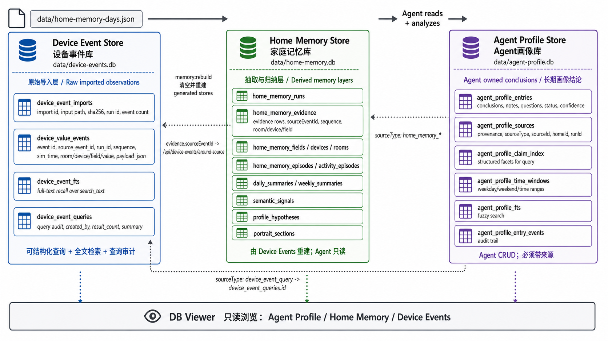
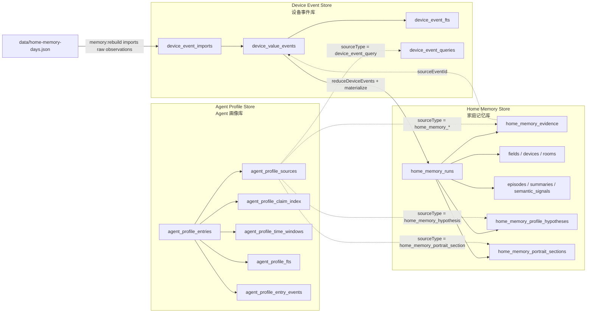
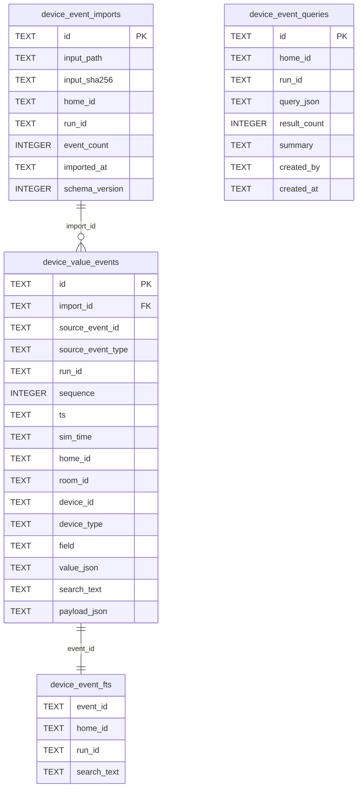
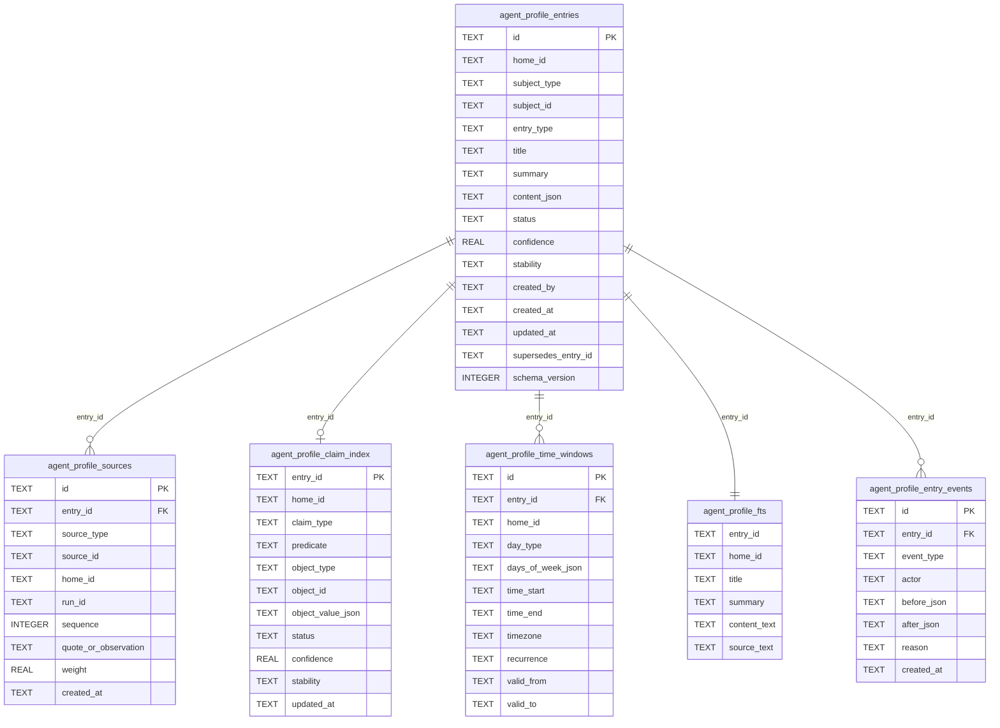
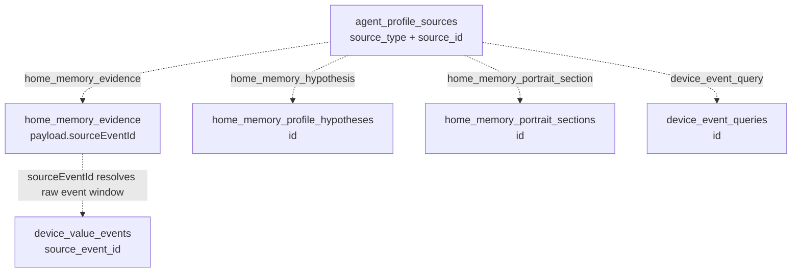

# Memory Store Schema Diagram

This document contains deterministic Mermaid diagrams for the three persistent memory stores:

- `data/device-events.db`
- `data/home-memory.db`
- `data/agent-profile.db`

Generated overview image:

## Database Boundary

## Device Event Store

## Home Memory Store

```mermaid
erDiagram
  home_memory_runs ||--o{ home_memory_evidence : "home_id, run_id"
  home_memory_runs ||--o{ home_memory_fields : "home_id, run_id"
  home_memory_runs ||--o{ home_memory_devices : "home_id, run_id"
  home_memory_runs ||--o{ home_memory_rooms : "home_id, run_id"
  home_memory_runs ||--o{ home_memory_episodes : "home_id, run_id"
  home_memory_runs ||--o{ home_memory_activity_episodes : "home_id, run_id"
  home_memory_runs ||--o{ home_memory_daily_summaries : "home_id, run_id"
  home_memory_runs ||--o{ home_memory_weekly_summaries : "home_id, run_id"
  home_memory_runs ||--o{ home_memory_semantic_signals : "home_id, run_id"
  home_memory_runs ||--o{ home_memory_profile_hypotheses : "home_id, run_id"
  home_memory_runs ||--o{ home_memory_portrait_sections : "home_id, run_id"
  home_memory_runs ||--o{ home_memory_materializations : "home_id, run_id"

  home_memory_runs {
    TEXT home_id PK
    TEXT run_id PK
    INTEGER covered_sequence
    TEXT reducer_version
    INTEGER schema_version
    TEXT materialized_at
    TEXT payload_json
  }

  home_memory_evidence {
    TEXT id PK
    TEXT home_id
    TEXT run_id
    INTEGER sequence
    TEXT sim_time
    TEXT room_id
    TEXT device_id
    TEXT field
    TEXT evidence_category
    REAL profile_weight
    TEXT payload_json
  }

  home_memory_fields {
    TEXT id PK
    TEXT home_id PK
    TEXT run_id PK
    TEXT room_id
    TEXT device_id
    TEXT field
    TEXT payload_json
  }

  home_memory_devices {
    TEXT id PK
    TEXT home_id PK
    TEXT run_id PK
    TEXT room_id
    TEXT payload_json
  }

  home_memory_rooms {
    TEXT id PK
    TEXT home_id PK
    TEXT run_id PK
    TEXT payload_json
  }

  home_memory_profile_hypotheses {
    TEXT id PK
    TEXT home_id PK
    TEXT run_id PK
    TEXT type
    TEXT summary
    REAL confidence
    TEXT updated_at
    TEXT evidence_ids_json
    TEXT payload_json
  }

  home_memory_portrait_sections {
    TEXT id PK
    TEXT home_id
    TEXT run_id
    TEXT section_id
    TEXT summary
    REAL confidence
    TEXT evidence_ids_json
    TEXT payload_json
  }

  home_memory_episodes {
    TEXT id PK
    TEXT home_id PK
    TEXT run_id PK
    TEXT kind
    TEXT status
    TEXT updated_sim_time
    TEXT payload_json
  }

  home_memory_activity_episodes {
    TEXT id PK
    TEXT home_id PK
    TEXT run_id PK
    TEXT kind
    TEXT updated_sim_time
    TEXT payload_json
  }

  home_memory_daily_summaries {
    TEXT id PK
    TEXT home_id PK
    TEXT run_id PK
    TEXT payload_json
  }

  home_memory_weekly_summaries {
    TEXT id PK
    TEXT home_id PK
    TEXT run_id PK
    TEXT payload_json
  }

  home_memory_semantic_signals {
    TEXT id PK
    TEXT home_id PK
    TEXT run_id PK
    TEXT type
    TEXT updated_at
    TEXT payload_json
  }

  home_memory_materializations {
    INTEGER id PK
    TEXT home_id
    TEXT run_id
    INTEGER covered_sequence
    TEXT reducer_version
    INTEGER schema_version
    TEXT materialized_at
  }
```

## Agent Profile Store

## Cross-Store References

